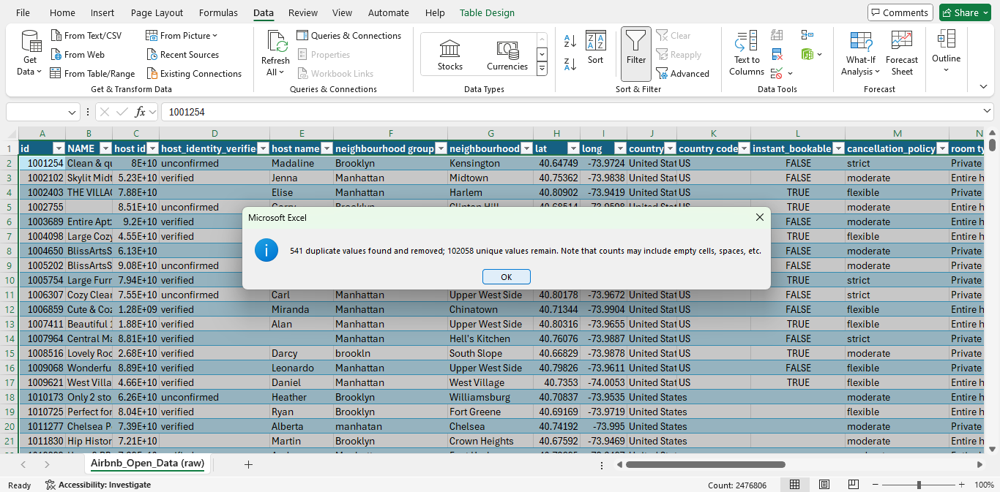
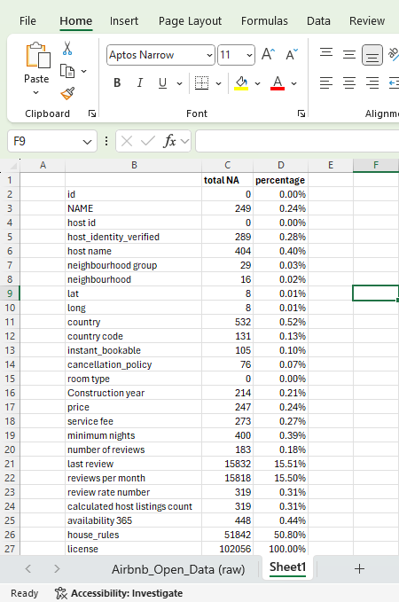
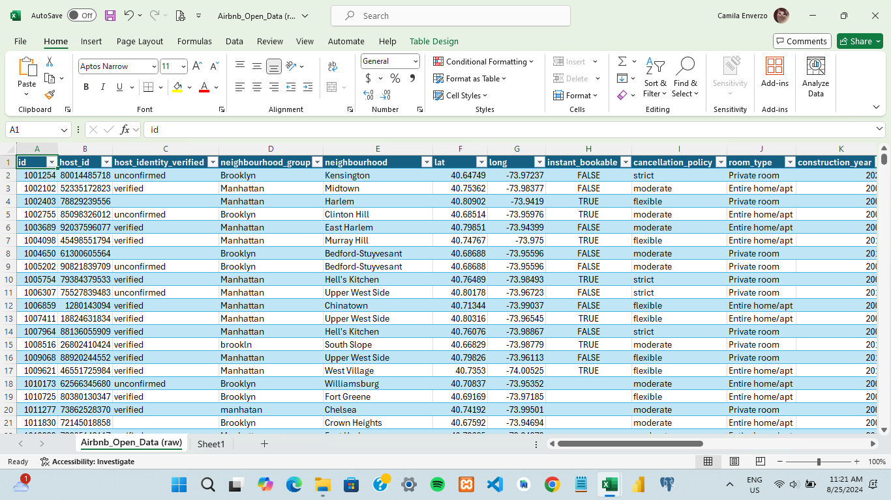
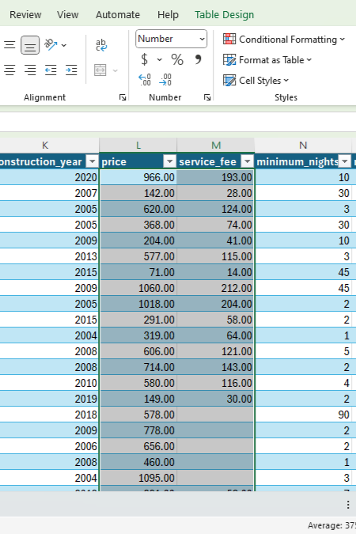
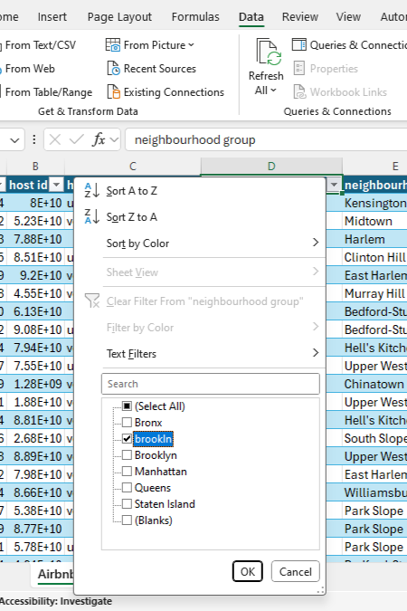
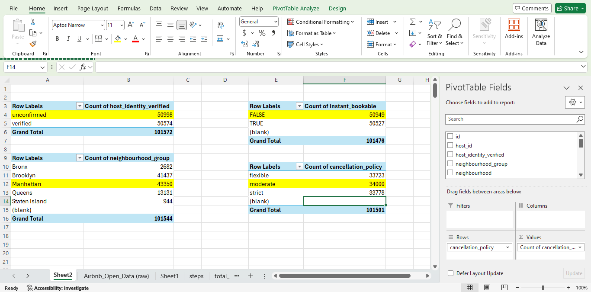
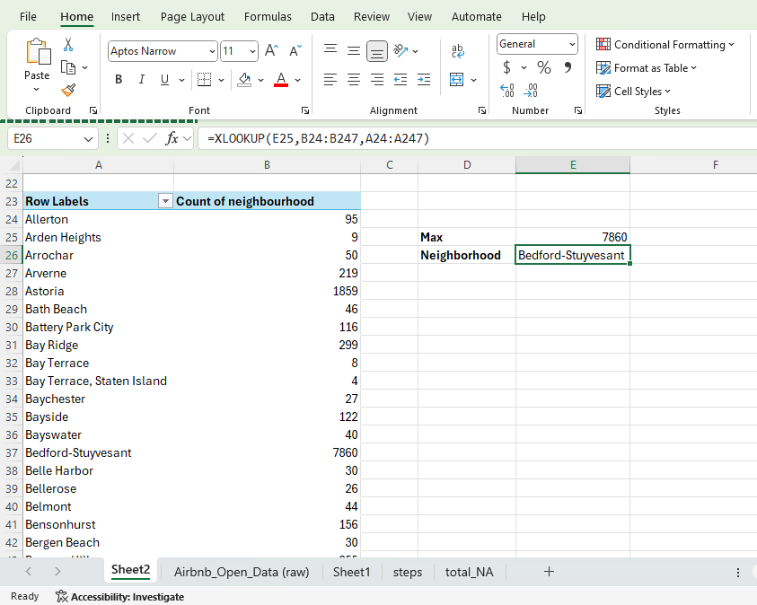
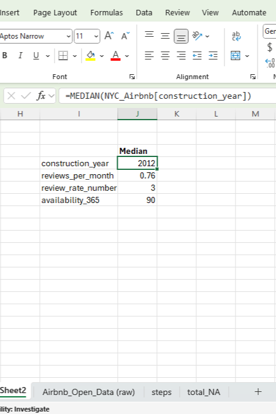
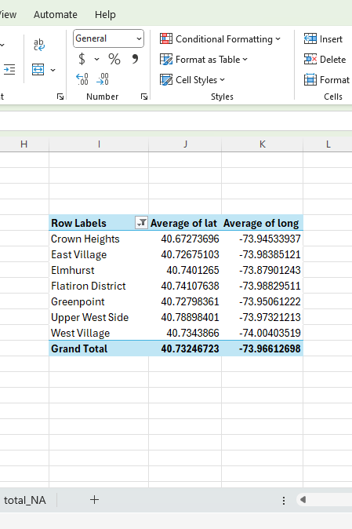

## Data Cleaning Process

This project showcases the data cleaning process of the [Airbnb Open Data](https://www.kaggle.com/datasets/arianazmoudeh/airbnbopendata/data) using Excel. The dataset was sourced from Kaggle and contains information about Airbnb listings in New York City.

1. **Remove Duplicates**
   

2. **Drop Columns with Significant Missing Values**
   - Removed 'house_rules' and 'license' columns due to a high percentage of missing values.
   

3. **Drop Unnecessary Columns**
   - Removed columns like 'NAME', 'host name', 'country', 'country code', 'last review', 'calculated host listings count' that were deemed irrelevant for the analysis.

4. **Rename Columns**
   - Converted all names to lowercase and replaced spaces with underscores (_) for cnsistency.
   

5. **Convert Price and Service Fee to Numeric**
   - Converted 'price' and 'service_fee' columns from currency formats to numeric data types to facilitate accurate calculations and analysis.
   

6. **Handle Missing Values in Critical Columns**
   - Deleted rows with missing values in columns such as 'price' and 'service_fee'.

7. **Correct Misspellings in Neighborhood Group**
   - Identified and corrected any misspelled data entries in the 'neighborhood_group' column to ensure consistency.
   

8. **Impute Missing Values for Minimum Nights**
   - Replaced missing values in the 'minimum_nights' column with a default value of '1', assuming a minimum stay of one night.

9. **Impute Missing Values for Number of Reviews**
    - Replaced missing values in the 'number_of_reviews' column with '0'.

10. **Impute Missing Categorical Values with Mode**
    - Replaced missing values in categorical columns such as 'host_identity_verified', 'neighborhood_group', 'neighborhood', instant_bookable', and cancellation_policy' with the most frequent value (mode). Used pivot table to count distinct values and formulas like 'MAX()' and 'XLOOKUP()' to identify and apply the most frequent value.
    
    

11. **Impute Missing Numerical Values with Median**
    - Replaced missing values in numerical columns like 'construction_year', 'reviews_per_month', 'review_rate_number', and 'availability_365' with the median value using the 'MEDIAN()' formula to mitigate the impact of outliers.
    

12. **Impute Missing Geospatial Data**
    - Replaced missing values in the 'lat' and 'long' columns with the mean values, grouped by 'neighborhood', using pivot table.
    

13. **Correct Negative Values in Numeric Columns**
    - Removed negative signs from values in the 'minimum_nights' and 'availability_365' columns to ensure all values are positive.

14. **Caps Values in Numerical Columns**
    - Removed unrealistic values by capping the 'reviews_per_month' column at 31 and the 'availability_365' column at 366.
